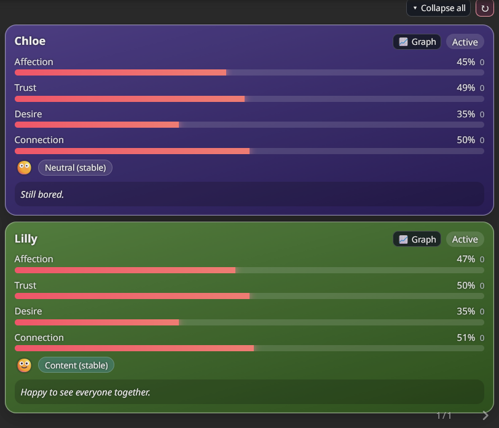
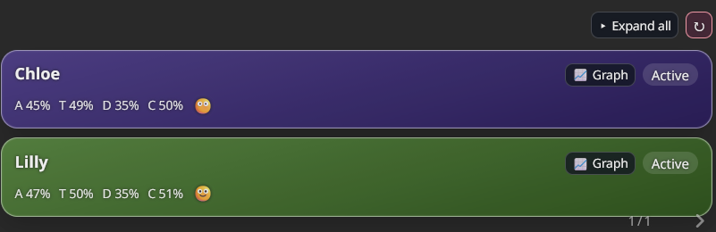
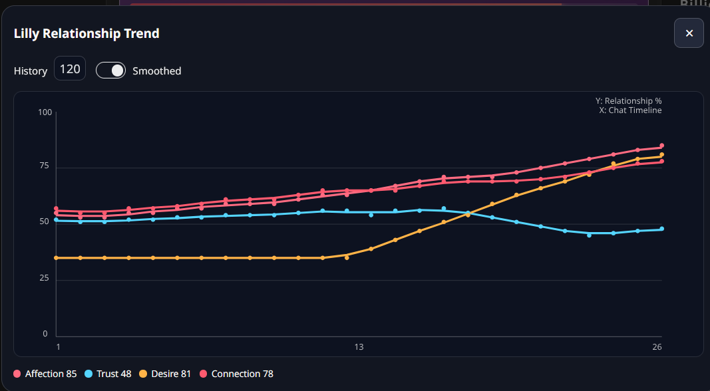
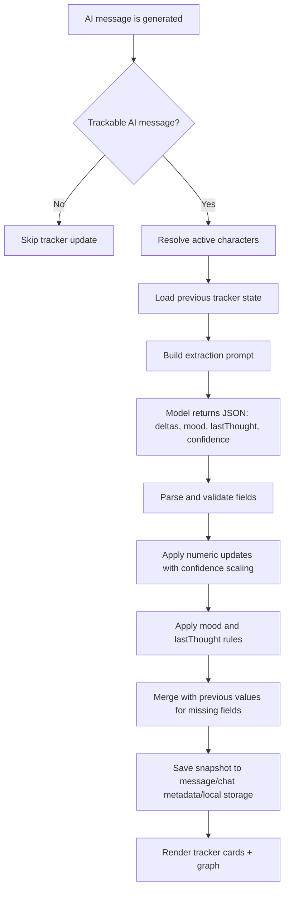
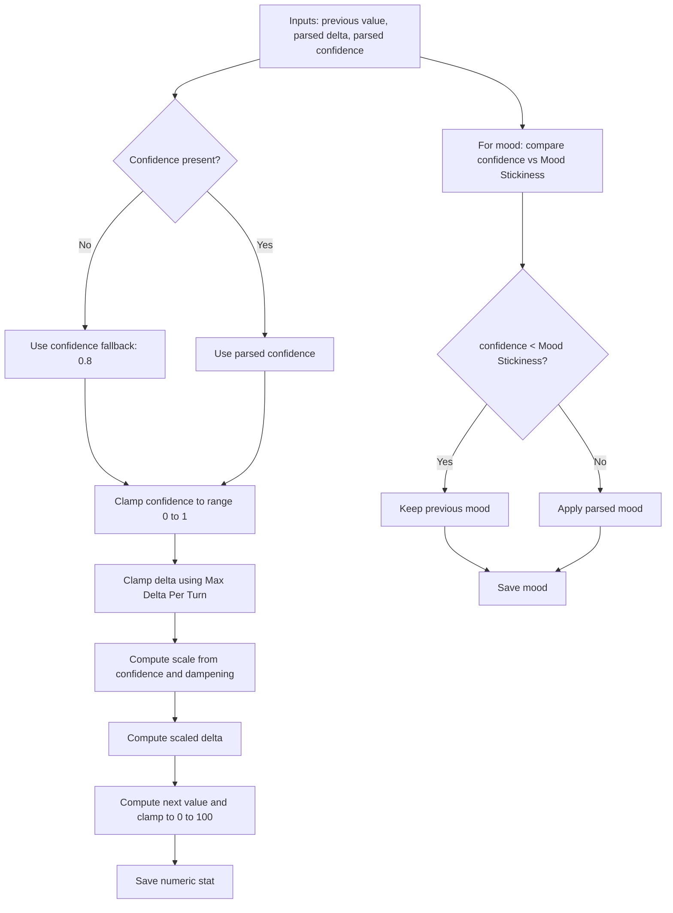

# BetterSimTracker

BetterSimTracker is a SillyTavern extension for relationship/state tracking in roleplay chats.

It tracks character relationship stats over time, stores them per AI message, visualizes progression, and can inject the current relationship state into prompts to keep behavior more coherent.

## Key Features

- Per-message tracker cards directly in chat
- Historical tracking (older AI messages keep their own past state)
- Group chat support (multiple character cards in one message)
- Scene activity detection (active vs inactive character state)
- Polished tracker action controls for `Collapse cards`, `Summarize`, and `Retrack`
- Polished extension settings modal with sticky header/footer actions and one-click `Expand all` / `Collapse all` section control
- Settings checkboxes now use consistent round accent-matched styling across ST themes/mobile UI overrides
- Built-in stats manager wizard with unified `Enabled` toggle (`Track + Card + Graph`) plus `Inject` control for numeric built-ins
- Custom stats section in settings with guided `Add / Edit / Clone / Remove` wizard flow (numeric percentage stats, max 8, color picker + hex input, AI-assisted description improvement, AI generation for stat-specific Sequential Prompt Override)
- Retrack button (regenerate tracker for last AI message)
- Summarize button (AI-generated prose summary, no numeric stat values, posted via native ST system message flow)
- Relationship graph modal:
  - history window (`30 / 60 / 120 / all`)
  - raw/smoothed view
  - multi-stat lines (built-ins + enabled custom graph stats)
- Prompt injection (optional) for behavior consistency
- Prompt injection includes enabled custom stats marked `includeInInjection`
  - when injected guidance grows too large, custom stat lines are trimmed first to keep prompt size safe
- Prompt templates (unified + per-stat + custom numeric default) with per-prompt reset
- AI-assisted generation for built-in sequential prompt instructions (`Affection`, `Trust`, `Desire`, `Connection`, `Mood`, `LastThought`)
- Mood source switch: BST mood images or ST expressions (emoji fallback always available)
- Interactive ST expression framing editor with live preview (global + per-character override)
- Click-to-preview mood image lightbox with close button / backdrop / Esc support (native top-layer dialog path on supported browsers)
- Active-first tracker card ordering in group chats with stable per-message order
- Per-stat colored bars, subtle card/stat update animations, and reduced-motion support
- Expandable last-thought text (`More` / `Less`) in cards and mood bubbles
- Framing modal includes `Preview Character` selector under the preview (global mode)
- Global preview candidates skip characters currently resolved to `BST mood images`
- Global preview sprite scan ignores BST mood-image assets with `bst_` prefix
- Strong diagnostics/debug dump for bug reports
- Mobile-friendly tracker cards, settings modal, and graph modal
- Settings section drawers collapsed by default
- Single-click Stop now hard-cancels the current extraction run (workers + retries)

## Screenshots

1. Tracker cards in chat  


2. Tracker cards (group chat)  


3. Collapsed tracker cards  


4. Tracker graph  


5. Settings modal  


## What It Tracks (By Default)

- `Affection`: emotional warmth and care
- `Trust`: safety, reliability, willingness to open up
- `Desire`: attraction and flirt/sexual tension
- `Connection`: bond depth and emotional attunement
- `Mood`: short-term emotional tone
- `Last Thought`: short internal state line

## Installation

Install directly from the GitHub repo in SillyTavern:

1. Copy this repository URL: `https://github.com/ghostd93/BetterSimTracker`
2. In SillyTavern, open Extensions (stacked cubes) -> `Install Extension`
3. Paste the repo URL and install (optionally pick branch/version)
4. Reload SillyTavern and enable `BetterSimTracker`

`dist` is committed to this repository, so users do not need to run a local build.

## Updating

Pull/update the extension to the latest commit in SillyTavern.

Hard refresh browser if old UI/assets are cached.

## Development (Contributors)

Only needed if you are editing TypeScript source and regenerating `dist`:

```bash
npm install
npm run build
```

## Quick Usage

1. Send/generate an AI message.
2. Tracker appears under AI messages (not user messages).
3. Open extension settings from Extensions panel.
4. Optional:
   - enable prompt injection
   - tune extraction mode (unified/sequential)
   - enable debug if you need diagnostics
5. Use graph button on a character card to view relationship trends.

## Workflow (Visual)

### 1) Tracker Generation Flow



### 2) Stat Calculation Flow



Numeric scaling formula used by runtime:

`scale = (1 - confidenceDampening) + confidence * confidenceDampening`  
`scaledDelta = round(clampedDelta * scale)`  
`nextStat = clamp(previousStat + scaledDelta, 0, 100)`

## Important Behavior Notes

- Tracker ignores generated-media/system image messages (for example SD image posts).
- Tracker progress should appear only for valid AI tracking targets.
- Automatic tracker extraction starts ~2 seconds after AI generation ends (waiting state stays visible during this delay).
- On the first post-generation extraction in a chat (no previous snapshot), sequential mode is forced to one request at a time for stability.
- First-run custom stat values are seeded from configured defaults and not requested from the model until a prior value exists.
- Tracker progress includes a Stop button to cancel extraction.
- On reload, tracker state is restored from saved chat metadata/message data.
- If extraction fails, provisional baseline values are not saved as final tracker state.
- If BetterSimTracker `Connection Profile` is empty, extraction automatically uses SillyTavern's currently active connection profile.

## Settings Overview

- `Sequential Extraction`: one request per stat (more robust, slower)
- `Unified Extraction`: one combined request (faster)
- `Max Concurrent Requests`: parallelism in sequential mode
- `Strict JSON Repair`: retries if model output is invalid
- `Auto Detect Active`: scene-based active character detection
- `Inject Tracker Into Prompt`: uses current relationship state as hidden guidance
- `Injection Depth`: controls prompt-injection depth in the in-chat prompt stack (`0..8`)
- `Injection Prompt Template`: editable template for injected guidance (shown only when injection is enabled)
- `Prompt Templates`: edit unified + per-stat sequential prompt instructions plus a global custom-numeric sequential default (protocol blocks are fixed; repair prompts are fixed)
- `Manage Built-in Stats`: open a wizard to control built-in stat participation in extraction/cards/graph/injection
- `Custom Stats`: create and manage additional numeric percentage stats via step-by-step wizard in settings
- `Profile Token Limits`: extraction now respects profile max tokens and truncation length (when available)
- `Max Tokens Override`: force max tokens for extraction (0 = auto)
- `Context Size Override`: force truncation length for extraction (0 = auto)
- `Include Character Cards in Extraction Prompt`: optional extra grounding when recent context is thin

## Slash Commands

- `/bst status`: show enabled stats, mode, injection, debug, and last tracked message index.
- `/bst extract`: manual extraction on the latest AI message.
- `/bst clear`: clear tracker data for the current chat.
- `/bst toggle <stat>`: toggle `affection|trust|desire|connection|mood|lastThought|<custom_stat_id>`.
- `/bst inject on|off`: toggle prompt injection.
- `/bst debug on|off`: toggle debug mode.
- Alias forms are also available: `/bst-status`, `/bst-extract`, `/bst-clear`, `/bst-toggle`, `/bst-inject`, `/bst-debug`.

## Settings Reference (Detailed)

### Extraction

- `Connection Profile`: use a specific SillyTavern connection profile for tracker extraction. Empty = active profile.
- `Sequential Extraction (per stat)`: one prompt per stat (`affection`, `trust`, `desire`, `connection`, `mood`, `lastThought`). Slower, usually more robust parsing.
- `Max Concurrent Requests`: only used in sequential mode. Controls parallel request count.
- `Strict JSON Repair`: retry/repair logic when model output is malformed or missing required fields.
- `Max Retries Per Stat`: max additional retry attempts per stage after the initial generation.
- `Context Messages`: number of recent chat messages included in extraction context.
- `Max Delta Per Turn`: hard clamp for how much one update can change a numeric stat.
- `Confidence Dampening`: scales delta strength by model confidence.
- `Mood Stickiness`: keeps mood stable unless model confidence/context strongly supports change.
- `Inject Tracker Into Prompt`: inject hidden relationship state guidance into chat generation prompts.
- `Injection Depth`: depth value passed to ST extension prompt injection (`0` = nearest/top in-chat insertion, max `8`).
- `Injection Prompt Template`: editable template that defines the injected guidance block (shown only when injection is enabled).
- `Auto Detect Active`: in group chat, tries to determine which characters are currently active in the scene.
- `Activity Lookback`: recent-message window used for active character detection.
- `Prompt Templates`: unified prompt instruction for one-shot extraction, per-stat instructions for sequential mode, and a global default template for custom numeric sequential extraction.
  - Each prompt has a reset-to-default button.
  - Protocol blocks (JSON shape, constraints) are fixed for safety and consistency.
  - A hidden main prompt is always prefixed to extraction prompts (not shown in settings).
  - Strict/repair prompts are fixed for safety and consistency.
- `Profile Token Limits`: extraction uses the selected connection profile's max token and truncation limits when available. If missing, it falls back to the active preset values, and finally to a safe default.
- `Max Tokens Override`: set a fixed token limit for extraction requests. Use `0` to keep profile/preset defaults.
- `Context Size Override`: set a fixed truncation length for extraction context. Use `0` to keep profile/preset defaults.
- `Include Character Cards in Extraction Prompt`: appends card description/personality/scenario to extraction context for disambiguation only.

Model confidence behavior:

- The model returns a per-character `confidence` value in range `0..1`.
- Numeric deltas are scaled by that confidence via `Confidence Dampening`:
  - `0` dampening = ignore confidence.
  - `1` dampening = fully trust confidence scaling.
- `Mood Stickiness` uses confidence as a gate: low confidence keeps previous mood.
- If confidence is missing for a character, runtime fallback is `0.8`.

### How Stat Updates Are Applied (Exact Runtime Logic)

For each active character and numeric stat (`affection`, `trust`, `desire`, `connection`):

1. Read previous value:
   - from prior tracker state for that character, else stat default.
2. Read model delta and clamp:
   - `boundedDelta = clamp(delta, -MaxDeltaPerTurn, +MaxDeltaPerTurn)`
3. Read confidence:
   - parsed `confidence` in `0..1`, fallback `0.8` if missing.
4. Compute scale:
   - `scale = (1 - ConfidenceDampening) + confidence * ConfidenceDampening`
5. Apply:
   - `scaledDelta = round(boundedDelta * scale)`
   - `next = clamp(previous + scaledDelta, 0, 100)`

Behavior notes:

- `ConfidenceDampening = 0`: confidence has no effect (`scale = 1`).
- `ConfidenceDampening = 1`: confidence fully controls delta strength (`scale = confidence`).
- Mood is not delta-based:
  - if `confidence < MoodStickiness`, keep previous mood;
  - otherwise apply parsed mood.
- `lastThought` is direct text replacement when present.
- Missing parsed fields keep prior values via merge fallback.

### Extraction Priority (Actual Runtime Logic)

1. Extraction runs only after a valid chat generation cycle that rendered a new AI character message.
2. Target message selection:
   - explicit message index (edit/swipe/manual target) if provided and trackable,
   - otherwise latest trackable AI message.
3. Trackable AI message means:
   - not user message,
   - not system message,
   - not generated-media/system image attachment message.
4. Existing tracker data is not overwritten unless trigger is forced (`manual_refresh`, edit/swipe events).
5. Active characters are resolved first (`Auto Detect Active` + `Activity Lookback`).
6. Enabled stats are requested in fixed order:
   - `affection`, `trust`, `desire`, `connection`, `mood`, `lastThought`
7. Mode behavior:
   - Unified mode: one prompt for all enabled stats.
   - Sequential mode: one prompt per stat; with concurrency > 1, stages run in parallel (finish order not guaranteed).
8. Retry chain per stage (when `Strict JSON Repair` is enabled):
   - initial generation,
   - strict JSON retry,
   - stat-specific repair retry (`mood` / `lastThought` only),
   - additional strict retries until retry budget is exhausted.
9. Application rules:
   - Numeric stats use deltas from previous values, clamped by `Max Delta Per Turn`, then confidence-scaled by `Confidence Dampening`.
   - `mood` uses `Mood Stickiness` (low confidence can keep previous mood).
   - Missing parsed fields keep previous values via merge fallback.

### Tracked Stats

- `Manage Built-in Stats` wizard:
  - built-ins stay non-deletable for backward compatibility
  - configure per built-in:
    - `Enabled` (numeric = `Track + Card + Graph`, text stats = `Track`)
    - `Inject` (numeric built-ins only)
- `Custom Stats` section:
  - `Add Custom Stat` wizard (Basics, Numeric Behavior, Tracking Behavior, Display, Review)
  - `Edit` and `Clone` for faster setup reuse
  - `Remove` uses soft-remove flow (historical payload remains stored, active tracking stops)
  - custom stat wizard uses unified `Enabled` toggle (`Track + Card + Graph`) plus `includeInInjection`
  - `Improve description by AI` (Basics step) rewrites the current description draft into a clearer extraction-focused definition
  - `Generate with AI` (Tracking Behavior step) drafts a stat-specific `Sequential Prompt Override` from required `Label`, `ID`, and `Description`
  - custom sequential prompt precedence: per-stat template override in wizard -> global `Seq: Custom Numeric` template -> built-in default template
- `Mood Source` (`BST mood images` or `ST expressions`)
- `Global Mood -> ST Expression Map` (editable in settings when `Mood Source = ST expressions`)
- `Preview Character` selector (inside framing modal, below preview): includes only characters with ST expressions and drives global framing preview
- `Adjust ST Expression Framing` button (opens interactive zoom/X/Y preview editor when `Mood Source = ST expressions`)
  - X/Y positioning works at all zoom levels (including `1.0`) with zoom-aware framing behavior at higher zoom levels
  - Framer preview and tracker cards use the same positioning math, so preview framing matches tracker rendering
  - Positioning uses zoom-aware pan compensation (`object-position` + translated scale), and existing tracker cards update immediately when framing is changed

You can disable any metric you do not want extracted. Disabled stats stop updating on future extractions; historical cards and graphs still show recorded values. Prompt injection uses only stats that are both tracked and explicitly enabled for injection (`Inject` for built-ins, `includeInInjection` for custom stats).

### Display

- `Show Inactive`: show cards for inactive/off-scene characters.
- `Inactive Label`: label text used for inactive cards.
- `Show Last Thought`: show/hide `lastThought` text on cards.
- `Accent Color`: primary UI accent for bars/buttons/highlights.
- `Card Opacity`: tracker card opacity.
- `Border Radius`: tracker card corner radius.
- `Font Size`: base tracker text size.

### Debug

- `Debug`: enables verbose diagnostics behavior.
- `Include Context In Diagnostics`: include extraction prompt/context text in dumps (larger output, potentially sensitive).
- `Include Graph Data In Diagnostics`: include graph series payloads in diagnostics.
- `Retrack` (`refresh icon`): regenerate tracker for the last AI message.
- `Delete Tracker Data (Current Chat)`: remove tracker data only for current chat.
- `Dump Diagnostics`: copy full diagnostics JSON to clipboard.
- `Clear Diagnostics`: clear stored debug traces/last debug record.

### Prompt Templates (Editable)

Two editable prompt types are supported:

- Unified prompt: used when sequential extraction is off.
- Per-stat prompts: used in sequential mode (`affection`, `trust`, `desire`, `connection`, `mood`, `lastThought`).
- `Seq: Custom Numeric` prompt: global default for custom stat sequential extraction when a custom stat does not define its own template override.
- Default desire prompt guardrail: only increase desire when the recent messages are explicitly romantic/sexual; non-romantic context should be 0 or negative.

Each prompt instruction can be reset to its default with the per-prompt reset button. Protocol blocks are read-only.
Built-in sequential prompt sections also include `Generate with AI` to draft a stat-specific instruction using your current connection profile.

Available placeholders:

- `{{envelope}}`: prebuilt header that already includes user/character names and recent messages.
- `{{userName}}`: current user name.
- `{{characters}}`: comma-separated character names.
- `{{contextText}}`: raw recent messages text.
- `{{currentLines}}`: current tracker state lines.
- `{{historyLines}}`: recent tracker snapshot lines.
- `{{numericStats}}`: requested numeric stats list.
- `{{textStats}}`: requested text stats list.
- `{{maxDelta}}`: configured max delta per turn.
- `{{moodOptions}}`: allowed mood labels.
- `{{statId}}` / `{{statLabel}}`: custom stat id/label (custom sequential templates).
- `{{statDescription}}` / `{{statDefault}}`: custom stat metadata (custom sequential templates).

Note: strict/repair prompts are not editable.

### Character Defaults (Advanced Card Definitions)

Per-character defaults can be set in character card Advanced definitions:

- `affection`
- `trust`
- `desire`
- `connection`
- `mood`
- `customStatDefaults` (for configured custom stats; key = stat id, value = 0..100)

All numeric character defaults are limited to `0..100` (UI + save sanitization).

Direct key path:

- `extensions.bettersimtracker.defaults`

Optional per-character mood source keys:

- `moodSource`: `bst_images` or `st_expressions`
- `moodExpressionMap`: mood label to ST expression label map (per mood, optional)
  - Character-level values override the global map from extension settings
  - Empty character-level values fall back to the global map, then built-in defaults
- `stExpressionImageOptions`: optional framing override for ST expressions:
  - `zoom`
  - `positionX`
  - `positionY`
  - UI path: enable `Advanced image options (override global)` and use `Adjust ST Expression Framing`
  - Character defaults framing preview uses one of that character's ST expression sprites
  - `moodSource = st_expressions` is blocked when the character has no ST expression sprites
  - In Advanced Definitions UI, ST-expression mapping/framing controls are shown only when the effective mood source resolves to `st_expressions`
  - BST mood-image upload controls are shown only when the effective mood source resolves to `bst_images`

Character-default records are resolved by stable character identity first (avatar), with legacy name-based fallback, so group-card and character-list entry paths stay consistent.
In Advanced Definitions, the panel also follows the character ST reports as currently opened in the editor to avoid group-chat context bleed.

If no advanced defaults are present, tracker baseline falls back to global extension defaults.

Mood images are optional per label; missing images fall back to emoji.  
When source is `st_expressions`, tracker maps mood to expression and uses the character sprite if found; missing mappings/sprites also fall back to emoji.
For `st_expressions`, tracker uses face-focused framing (top-centered crop) to better match portrait-style sprites.
If no ST expression sprites are available, framing editor opens in notice-only mode with guidance to add at least one expression sprite.

## Troubleshooting

If something looks wrong:

1. Enable `Debug`.
2. Use the debug category toggles to limit logs to the area you need.
3. Reproduce the issue once.
4. Click `Dump Diagnostics`.
5. Share the diagnostics output.

Common checks:

- Wrong/empty tracker: verify selected connection profile and extraction settings.
- UI issues after update: hard refresh browser.
- Group edge cases: retrack last AI message once after major chat edits/swipes.

## License

This project is licensed under the MIT License. See `LICENSE`.

